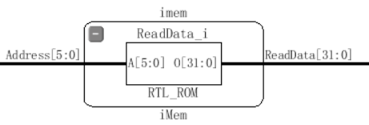
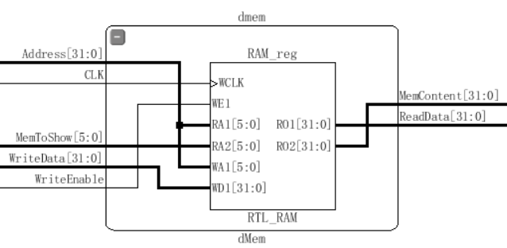
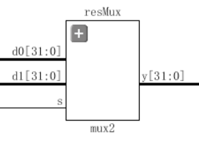
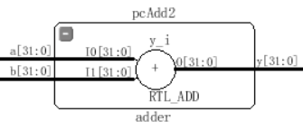
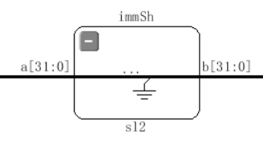

<center> <font size=5> <b>32位MIPS单周期CPU实验报告</b></font>
</center>
<p align=right> <strong>聂希瑞 16307130133</strong></p>

[TOC]
#### 一、实验目的

1、通过对32位单周期CPU的设计实验，完成MIPS指令集的子集功能，掌握单周期CPU的数据通路原理、设计和实现方法。学会从0开始逐步设计一个较为完整的微体系结构，从而锻炼由整体到局部再到整体的解决问题的能力。

#### 二、实验原理

##### 1、单周期CPU运行

单周期微体系结构在一个周期中执行一条完整的指令，每个时钟到来时，先后经历以下操作：

-   **Fetch Instruction**

-   **Update PC**

-   **Instruction Decode**

-   **Execute Instruction(ALU)**

-   **Memory Access**

-   **Write Back**

##### 2、CPU构成

CPU的主要构成：Datapath 和Control。

###### (1) Datapath

Datapath由两类元件组成：

-   **状态元件**  包括程序计数器（PC）、指令存储器（IM）、数据存储器（DM）和寄存器文件（RF）；这些元件的状态改变只发生在时钟上升或者下降沿，是同步时序电路。输入端状态由时钟决定写入，输出端随时可以被读出。
<center class="image">




</center>


>Program Counter: 普通的32位寄存器，输出PC指向当前指令。在实现过程中使用了可复位触发器、复用器、加法器等等元件。
>
>Instruction Memory: 正常情况下，应该有一个32位的写入端口和一个读出端口，此处为了调试方便，在module内部将指令初始化，然后仅仅提供一个6位的地址输入端口和32位的指令输出端口。
>
>Data Memory: 数据存储器的输入端口有：32位的地址输入端口、写入端口、CLK和WriteEnable；输出端口有32位的ReadData端口。为了展示方便，我添加了用以内存泄漏的6位输入端口和32位输出端口分别用以输入内存相对地址和输出该地址所存内容。
>
>Register File: 寄存器文件由32个32位寄存器组成，因而提供3个5位地址输入端口分别是A1, A2和A3，另外有一个32位写入数据端口，还有CLK、WriteEnable3以及两个32位的输出端口RD1和RD2。同样的，为了内存泄漏，我添加了相应的输入输出端口。

-   **操作元件**  操作元件主要包括算术逻辑单元（ALU）、复用器（MUX)、符号扩展（SignExtend）、加法器、位移两位器等元件，这些元件是组合逻辑电路，完成对所取得的操作数进行运算、选择、扩展等工作，然后将结果交回给状态原件进行读写。
<center class="image">




</center>


>ALU: 算术逻辑单元将多种算术和逻辑运算组合到一个单元内，从通过op[2:0]进行功能选择，对输入的a[31:0]和b[31:0]进行相应的运算，并将结果输出。此处提供一个zero输出端口以供使用。
>
>MUX: 复用器用于两个相同长度的数据的多选一功能。用户可以自定义数据长度然后对数据输入进行选择输出。（图上以32位MUX为例）。后期加指令时为了方便重新加了两个MUX4。
>
>SignExtend: 符号扩展用于将16位立即数进行符号扩展，此处必须设置一个exp输入端来决定是进行0扩展还是符号扩展（ori和andi指令）。
>
>Adder: 加法器实现的是两个32位数进行相加的功能。
>
>移位器：将输入的32位数据算术左移两位补0输出。

###### (2) Control

Control主要由两部分元件组成：

<center class="image">


</center>
-   **Main Decoder**  主译码器负责的功能是对输入指令的op code部分进行译码，从而将对一个的控制信号输出。后期加指令的时候为了方便，把Function Code也传入mainDecoder了。详细介绍见第三部分的实验内容。
-   **ALU Decoder**  ALU译码器完成的功能是对输入指令的Function Code部分以及一些I-Type的指令进行译码操作，详细介绍见第三部分的实验内容。

#### 三、实验内容

##### 1、指令集（Instruction Set)

本次实验实现的指令集主要包括以下部分：

###### 1.1 R-type Instruction

| Instruction | op(6), rs(5), rt(5), rd(5), shamt(5), func(6) |    Write Style    | Function Code |
| :---------: | :-------------------------------------------: | :---------------: | :-----------: |
|     add     |            R[rd] <= R[rs] + R[rt]             | add $rd, $rs, $rt |    100000     |
|     sub     |            R[rd] <= R[rs] - R[rt]             | sub $rd, $rs, $rt |    100010     |
|     and     |            R[rd] <= R[rs] & R[rt]             | and $rd, $rs, $rt |    100100     |
|     or      |            R[rd] <= R[rs] & R[rt]             | or $rd, $rs, $rt  |    100101     |
|     slt     |        R[rd] <= R[rs] < R[rt] ? 1 : 0;        | slt $rd, $rs, $rt |    101010     |
|     xor     |            R[rd] <= R[rs] ^ R[rt]             | xor $rd, $rs, $rt |    100110     |

###### 1.2 Shift Instruction

| Instruction | op(6), rs(5)/0(5), rt(5), rd(5), sa(5), func(6) |   Write Style    |     Function Code      |
| :---------: | :---------------------------------------: | :--------------: | :--------------------: |
|     sra     |           R[rd] <= R[rt] >>>sa            | sra $rd, $rt, sa |         000011         |
| srav | R[rd] <= R[rt] >>>R[rs]\[4:0] | srav $rd, $rs, $rt | 000111 |
|     sll     |            R[rd] <= R[rt] <<sa            | sll $rd, $rt, sa |         000000         |
| sllv | R[rd] <= R[rt] <<R[rs]\[4:0] | sllv $rd, $rs, $rt | 000100 |
| srl | R[rd] <= R[rt] >>sa | srl $rd, $rt, sa | 000010 |
| srlv | R[rd] <= R[rt] >> R[rs]\[4:0] | srlv $rd, $rs, $rt | 000110 |

###### 1.3 Load/Store Instruction

| Instruction |    op(6), base(5), rt(5), offset(16)     |     Write Style      | Op Code |
| :---------: | :--------------------------------------: | :------------------: | :-----: |
|     lw      | R[rt] <= M[R[base] + SignExtend(offset)] | lw $rt, offset(base) | 100011  |
|     sw      | R[rt] => M[R[base] + SignExtend(offset)] | sw $rt, offset(base) | 101011  |

###### 1.4 I-Type Instruction

| Instruction |      op(6), rs(5), rt(5), Imm(16)       |    Write Style     | Op Code |
| :---------: | :-------------------------------------: | :----------------: | :-----: |
|    addi     |    R[rt] <= R[rs] + SignExtend(Imm)     | addi $rt, $rs, Imm | 001000  |
|    andi     |    R[rt] <= R[rs] & ZeroExtend(Imm)     | andi $rt, $rs, Imm | 001100  |
|     ori     |    R[rt] <= R[rs] \| ZeroExtend(Imm)    | ori $rt, $rs, Imm  | 001101  |
|    xori     |    R[rt] <= R[rs] ^ ZeroExtend(Imm)     | xori $rt, $rs, Imm | 001110  |
|    slti     | R[rt] <= R[rs] < SignExtend(Imm) ? 1: 0 | slti $rt, $rs, Imm | 001010  |

###### 1.5 Branch Instruction

| Instruction |           op(6), rs(5), rt(5), offset(16)            |      Write Style      | Op Code |
| :---------: | :--------------------------------------------------: | :-------------------: | :-----: |
|     beq     | if R[rs] = R[rt] then PC <= PC + SignExtend(offset)  | beq, $rs, $rt, offset | 000100  |
|     bne     | if R[rs] != R[rt] then PC <= PC + SignExtend(offset) | bne, $rs, $rt, offset | 000101  |

###### 1.6 J-Type Instruction

| Instruction |                    op(6), instr_index(26)                    |   Write Style   | Op Code |
| :---------: | :----------------------------------------------------------: | :-------------: | :-----: |
|      J      |       PC[31:2] = PC[31:28] + instr_index[25:0] + {00}        |  J instr_index  | 000010  |
|     jal     | REG[31] = PC + 4;<br>PC[31:2] = PC[31:28] + instr_index[25:0] + {00} | jal instr_index | 000011  |

###### 1.7 J-R Instruction

| Instruction | op(0*6), rs(5), 0(5), 0(5), hint(5), funct(6) | Write Style | Function Code |
| :---------: | :-------------------------------------------: | :---------: | :-----------: |
|     jr      |                  PC <= R[rs]                  |   jr $rs    |    001000     |

###### 1.8 NOP Instruction

| Instruction | op(6), 0(5), 0(5), 0(5), 0(5), 0(6) | Write Style | Op Code |
| :---------: | :---------------------------------: | :---------: | :-----: |
|     nop     |             do nothing              |     NOP     | 000000  |

###### 1.9 Load Upper Immediate

| Instruction | op(6), 0(5), rt(5), Imm(16) | Write Style  | Op Code |
| :---------: | :-------------------------: | :----------: | :-----: |
|     lui     |    R[rt] <= Imm + {16*0}    | lui $rt, Imm | 001111  |

##### 2、控制信号（Control Signal）

###### 2.1 ALU真值表


| OP [2:0] |   Function   | OP [2:0] |   Function   |
| :------: | :----------: | :------: | :----------: |
|   0000   |    A & B     |   1000   |   b << 16    |
|   0001   |    A \|B     |   1001   |   b >>> sa   |
|   0010   |    A + B     |   1010   | b >>> a[4:0] |
|   0011   |    A ^ B     |   1011   |   b << sa    |
|   0100   |    A & ~B    |   1100   | b << a[4:0]  |
|   0101   |   A \| ~B    |   1101   |   b >> sa    |
|   0110   |    A - B     |   1110   | b >> a[4:0]  |
|   0111   | Set if A < B |   1111   |  a(for jr)   |

###### 2.2 Main Decoder真值表


| Control Signal | Meaning |
| :---:  | :---------: |
|    Op Code     | 识别指令 |
|    RegWrite    | 1 需要写入寄存器 0 不需要 |
|     RegDst[1:0]     | 01 R[rd]  00 R[rt] 10R[31]作为目的地寄存器 |
|     ALUSrc     | 1 SignImm 0 RD2 选择ALU B操作数来源 |
| Branch | 1 分支 0 不分支 |
| MemWrite | 1 需要写入内存 0 不要（WriteEnable） |
| Mem2Reg | 1 从内存读出写入寄存器 0 不要 |
| ALUOp[2:0] | 协同 Function Code 一起用于ALU Decoder 译码 |
| Jump | 1 发生跳转 0 不要 |
| ExS | 1 表示符号扩展 0 表示 0 扩展 |
| BranchNE | 1 分支 0 不分支（用于识别bne） |
| StorePCNext | 是否需要用register[31]存PC地址 |
| RegPC | 是否使用了regsiter存PC地址 |

###### 2.3 Instruction 真值表


| Instruction | {RegWrite, RegDst[1:0], ALUSrc, Branch, MemWrite, Mem2Reg, ALUOp[2:0], Jump, ExS, BranchNE, StorePCNext} |
| :---------: | :----------------------------------------------------------: |
|   R-type    |                        10100001110100                        |
|     lw      |                        10010010000100                        |
|     sw      |                        00010100000100                        |
|    addi     |                        10010000000100                        |
|    andi     |                        10010000100000                        |
|     ori     |                        10010000110000                        |
|    xori     |                        10010001010000                        |
|    slti     |                        10010001000100                        |
|      j      |                        00000000001100                        |
|     jal     |                        11000000001001                        |
|     bne     |                        00001000010100                        |
|     beq     |                        00001000010110                        |
|     nop     |                           default                            |
|     lui     |                        10010001100000                        |

##### 3、顶层显示（Top Display）

###### 3.1 功能显示

在上板子的时候主要用到SW[15:0]、AN[7:0]、LED[13:0]、LED16_G和LED17_R，以下是功能编码真值表

| Switch/LED |                     Input/Display                     |
| :--------: | :---------------------------------------------------: |
|  SW[7:0]   |             根据输入确定数码管显示的内容              |
|  SW[13:8]  | 当决定显示内存/寄存器时，输入以选择具体某一位置的内容 |
|   SW[14]   |                         Reset                         |
|   SW[15]   |                         Stop                          |
|  AN[7:0]   |              配合SW[7:0]显示32位数字内容              |
|  LED[4:0]  |                  显示寄存器写入地址                   |
| LED[10:5]  |                   显示内存写入地址                    |
|  LED[11]   |                    发生跳转(Jump)                     |
|  LED[12]   |                   发生分支(Branch)                    |
|  LED[13]   |              发生分支(Branch Not Equal)               |
|  LED16_G   |                 绿灯表示正在写寄存器                  |
|  LED17_R   |                  红灯表示正在写内存                   |

###### 3.2 SW[7:0]真值表

| Input SW[7:0] |      Show Case      |
| :-----------: | :-----------------: |
|   00000000    |         PC          |
|   00000001    |     Instruction     |
|   0000001x    |  Register Content   |
|   000001xx    |   Memory Content    |
|   00001xxx    | Register Write Data |
|   0001xxxx    |  Memory Write Data  |
|   001xxxxx    |    Data Address     |
|   01xxxxxx    |      Read Data      |
|   1xxxxxxx    |  Default(12345678)  |

###### 3.3 数据通路实现思路

​        整个设计思路主要是通过main Decoder根据Op Code对指令进行识别，然后赋给控制信号不同的值，从而控制各个部件的行为。

（1）实现R-type， shift-type类型的指令的时候，主要是在ALU Decoder里面进行分别处理，我把ALU的功能扩	  展到了4位共16种不同的选择，从而完成了六条移位指令。

（2）在实现jal的时候，为了把PC+4的值存到REG[31]里面，我用了一个MUX4将PC+4的值分支到寄存器的写入端	  口，由RegDst[1:0]\(已扩展)进行选择写入寄存器的数据来源。

（3）在实现jr的时候，同样的，我又把寄存器的值通过ALU什么也没做，流出来的结果Result接一个分支到PC	  端，由RegPC信号控制是否选择该输入作为下一个PC地址。

（4）ExS信号负责控制数字扩展的类型选择，只有当需要逻辑运算的时候才会用到0扩展。

（5）在设计显示模块的时候，一开始图省事直接写在top文件里，后来为了仿真方便把display和底层文件分开	  了。通过开发板的开关输入选择七段数码管的输出显示内容；利用LED显示Jump、Branch、BNE、内存和	  寄存器的写入地址，以及是否进行内存和寄存器的写入。最大限度地利用了开发板的显示功能，尽可能地显	  示了更多的内容。

##### 4、测试结果（Test Result）

###### 4.1 测试代码（Test Code）

```c
//Note: 这是经过注释的伪代码，十六进制数为正确代码，汇编代码并不规范。
//address		 Instruction				comment
[0]		20020005;//addi $2, $0, 5       //initialize $2 = 5
[4]     2003000c;//addi $3, $0, 12      //$3 = c
[8]     2067fff7;//addi $7, $3, -9 		//$7 = 3
[12]    00e22025;//or $4, $7, $2   		//$4 = 3 or 5 = 7
[16]    00642824;//and $5, $3, $4 		//$5 = 12 and 7 = 4
[20]    00a42820;//and %5, %5, $4 		//$5=4+7=11
[24]    10a7000a;//beq $5, $7, end 		//should not be taken
[28]    20150028;//addi $21, $0, 40;	//$21 = 40 = 0x28
[32]    02a00008;//jr $21;				//jump to ROM[10]
[36]    00000000;//nop
[40]    0064202a;//slt $4, $3, $4 		//$4 = 12 < 7 = 0;should not be taken due to jr
[44]    10800001;//beq $4, $0, around	//should be taken
[48]    20050000;//addi $5, $0, 0;		//should not be taken
[52]    00e2202a;//slt $4, $7, $2 		//$4 = 3 < 5 = 1 
[56]    00853820;//add $7, $4, $5 		//$7=1 + 11 = 12
[60]    00e23822;//sub $7, $7, $2 		//$7 = 12 - 5 = 7
[64]    ac670044;//sw $7, 68($3) 		//[80] = [1010000 >>2] = [10100] = [20] = 7
[68]    8c020050;//lw $2, 80($0) 		//$2 = 7
[72]    0c000018;//jal ROM[20]=80; 		//$31 = PC + 4; should be taken
[76]    08000018;//j ROM[20]=80; 		//should not be taken due to jal
[80]    20020001;//addi $2, $0, 1 		//should not be taken
[84]    ac020054;//sw $2, 84($0) 		//[84]=[84>>2] = [21] = 7
[88]    3c0c1234;//lui $12, 0x1234;		//$12 should be 12340000;
[92]    00a75046;//xor $10, $5, $7;		//$10 = 12
[96]    38ab0004;//xori $11, $5, 4;		//$11 = f
[100]   ac0c0010;//sw $12, 16($0);		//[16] = [16>>2] = Mem[4] = 12340000;
[104]   00054883;//sra $9, $5, 2; 		//$9 = 11 >>> 2 = 2
[108]   00854007;//srav $8, $4, $5;		//$8 = [$5] >>> [$4][4:0] = 5
[112]   000469c0;//sll $13, $4, 7; 		//$13 = [$4] << 7 = 00000080 = 128
[116]   00847004;//sllv $14, $4, $4;	//$14 = [$4] << [$4][4:0] = 2;
[120]   00037882;//srl $15, $3, 2; 		//$15 = [01100] >> 2 = 3;
[124]   00838006;//srlv $16, $4, $3 	//$16 = [$3] >> [$4][4:0]=00000110 = 6
[128]   00000000;//nop
```

###### 4.2 仿真测试 (Simulation)

以下为仿真结果：
<center class="image">

</center>
<center class="image">

</center>
<center class="image">

</center>
###### 4.3 开发板测试 (NEXYS 4 DDR)

上机课的时候助教已经验收过了，后来加的指令经过测试没有任何问题。如有疑惑请及时与本人联系。谢谢！

测试视频链接：https://pan.baidu.com/s/1zIqpsgGTMi7vCNa9RjVDFg 提取码：h5je 

#### 四、实验总结

##### **1. 申A理由 (Apply for A)**

（1）本次实验完成了对单周期CPU的MIPS指令集子集实现。
（2）在要求的15条指令之外，还**实现了额外的位移、跳转指令，总共实现了26条指令**，详细内容见本报告的第三	  部分Instruction Set。
（3）得益于jr和jal指令的实现，这个CPU能够完成**调用递归函数**的功能。
（3）在上这门课之前，我没接触过Verilog和开发板测试，能够完成要求并且实现额外的指令已经尽了自己最大努	  力。

##### 2. 反思和收获 (Pain And Gain)

（1）最大的收获是对单周期CPU的设计思路和数据通路的知识掌握有了长足的进步。
（2）需要反思的是在设计指令数据通路的时候并没有考虑门之间的延时可能引发的冒险冲突等问题，这部分问题	  可能会在第三阶段流水线CPU设计得到集中暴露，也相信自己有能力解决：）

#### 五、参考文献

[1] David Money Harris, Sarah L.Harris《Digital Design and Computer Architecture》中文版第二版

[2] MIPS32® Architecture For Programmers Volume II: The MIPS32® Instruction Set

[3] 陈辰 《1 MIPS微处理器原理-体系结构(MIPS汇编语言)》PPT

[4] www.baidu.com

