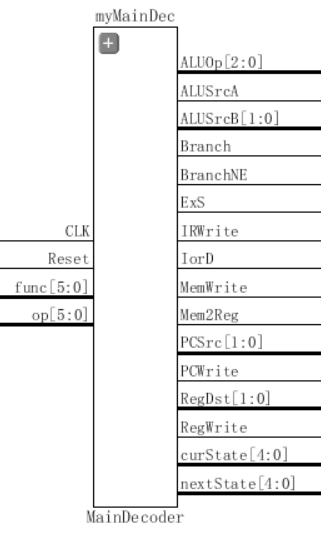
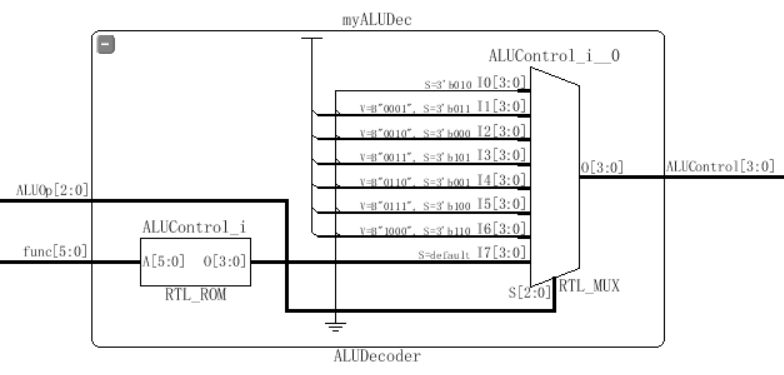
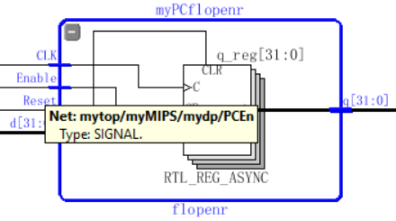
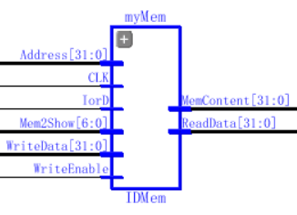
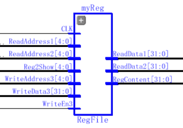
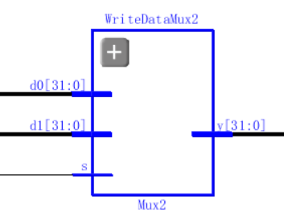
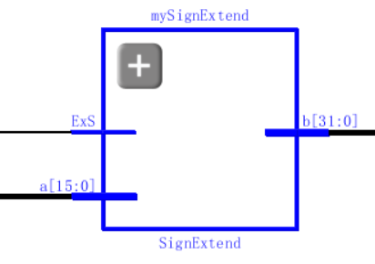
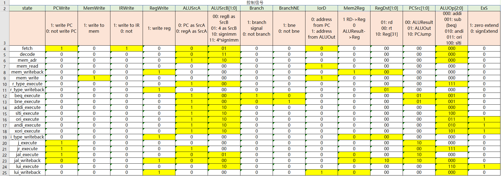
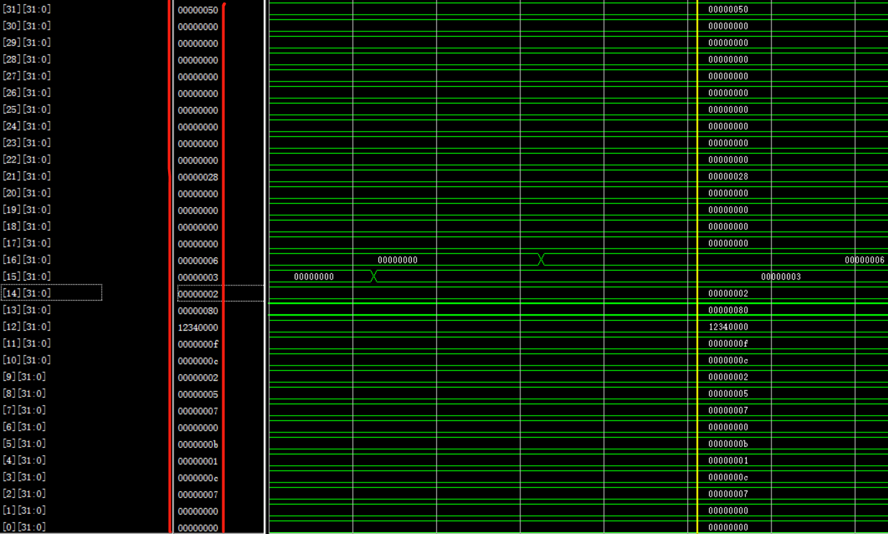

<center> <font size=5> <b>32位MIPS多周期CPU实验报告</b></font>
</center>
<p align=right> <strong>聂希瑞 16307130133</strong></p>

[TOC]

#### 一、实验目的

1、通过对上次实验的单周期CPU的重构和改进，重新设计多周期CPU，引入有限状态机(FSM)，提高CPU的运行效率和对ALU的利用率，进一步掌握CPU各个部件工作原理。

#### 二、实验原理

##### 1、多周期CPU原理

多周期CPU不再像单周期一样将一条指令放在一个周期内执行完毕（这样做看起来每条指令只需要一个周期，但实际上每个时钟周期的时间受限于执行时间最长的那条指令(lw)），而是将指令切割成若干个阶段（状态机），每个周期CPU只执行其中一个阶段，主译码器不再聚焦于具体的指令，而只关心根据指令编码而成的状态机的当前状态，并由此确定控制信号、使能信号和下一个状态的值。

##### 2、CPU构成

CPU的主要构成仍然可以分为Datapath和Controller两部分，跟之前不同的是这次优先介绍Controller部分。

<center class="image">

</center>

###### (1) Controller

在单周期的基础上，Controller仍然由Main Decoder和 ALU Decoder组成。

<center class="image">


</center>


-   **Main Decoder**  **主译码器做了比较大的改动**，引入了有限状态机模型（FSM），不再拘泥于对某一条指令进行单独的控制信号、使能信号的编码，而是将每条指令解析成若干阶段，每个阶段用一个状态表示，不同指令之间存在的相同状态（取指令、解析指令、写回等等）可以合并。主译码器要做的事就是根据当前状态给信号赋值并跳转下一状态。详细见第三部分的实验内容。
-   **ALU Decoder**  ALU译码器在多周期里并没有改变，完成的功能仍然是对输入指令的Function Code部分以及一些I-Type的指令进行译码操作，详细介绍见第三部分的实验内容。

###### (2) Datapath

Datapath的输入来自于主译码器的控制信号、使能信号以及寄存器和Memory部分，然后通向各个部件的输入端。部件仍然可以分为两类：

-   **状态元件**  包括可复位使能触发器（flopr）、指令数据存储器（IDM）和寄存器文件（RF）；这些元件的状态改变只发生在时钟上升或者下降沿，是同步时序电路。输入端状态由时钟决定写入，输出端随时可以被读出。相较于单周期实验，这里有了三个变化：

    a. 可复位触发器（flopr）新增使能端。例如PC引入PCEn信号作为写使能信号，在多周期里，为了使得元件计算结果得以保留至时钟沿触发时更新，使用了多个flopr，如PC flopr, ALUResult flopr, Instr flopr, MReadData flopr 和 RReadData flopr。

    b. IM和DM合并成IDM，这更符合实际情况并且更加可行，详细细节见IDM部分。

    c. 合成后的IDM不再独立于datapath之外，而是作为datapath内部的一个元件，这是为了方便信号的输入输出。

    <center class="image">
    
    
    
    </center>

    

    >   **flopr**：flopr的设计**引入了使能端**，其功能在于将输入的32位信号存入32位寄存器中，等待时钟沿来临，并且在写使能为1的情况下将值传出。flopr在多周期实验中被广泛地用于PC、Instruction、readData等值的暂存。
    >
    >   **IDM**：IDM是一个能够存储32x128的内存元件。我用前64个32位长度的内存作为指令存储的部分，后64个32位长度的内存作为数据存储的部分。并且，我设计了一个**虚拟地址到实际地址的映射**，在读或写信号传入IDM时，利用IorD信号判断想要读写的目标是指令还是数据，如果是指令，直接按传入的真实地址读取或写入；如果是数据，则把传入的读写地址加上64的偏移量进行处理。这样做的好处是，从CPU外部看来，Data Memory 仍然像是一个32x64的独立内存块，在进行内存有关的读写操作时，可以保持和单周期相同的地址，不需要因为Instruction Memory的并入而修改了。再者，为了datapath各个连线与Memory的交互更为简单（IorD的存在），我**把IDM放到datapath内部了**。最后，同样的，在开发板展示的时候仍然通过输入地址进行内存泄漏，查看内存中的具体值。
    >
    >   **Register File**：寄存器文件由32个32位寄存器组成，因而提供3个5位地址输入端口分别是A1, A2和A3，另外有一个32位写入数据端口，还有CLK、WriteEnable3以及两个32位的输出端口RD1和RD2。同样的，为了内存泄漏，我添加了相应的输入输出端口。

-   **操作元件** 操作元件主要包括算术逻辑单元（ALU）、多路选择器（MUX)、符号扩展器（SignExtend）、移位器等元件，这些元件是组合逻辑电路，完成对所取得的操作数进行运算、选择、扩展等工作，然后将结果交回给状态原件进行读写。

    <center class="image">
    
    
    
    
    
    </center>

    
    >   **ALU**： 算术逻辑单元将多种算术和逻辑运算组合到一个单元内，从通过op[2:0]进行功能选择，对输入的a[31:0]和b[31:0]进行相应的运算，并将结果输出。此处提供一个zero输出端口以供使用。
    >
    >   **MUX**： **多路选择器包括MUX4和MUX2**， 用于四个或两个相同长度的数据的多选一功能。用户可以自定义数据长度然后对数据输入进行选择输出。（图上以5位MUX4和32位MUX2为例）。
    >
    >   **SignExtend**：符号扩展用于将16位立即数进行符号扩展，此处必须设置一个ExS输入端来决定是进行**0扩展还是符号扩展**（ori和andi指令）。
    >
    >   **LeftShifter**：将输入的32位数据算术左移两位补0输出。

#### 三、实验内容

##### 1、指令集（Instruction Set) 

本次实验和单周期实验实现的指令集一样：

###### 1.1 R-type Instruction

| Instruction | op(6), rs(5), rt(5), rd(5), shamt(5), func(6) |    Write Style    | Function Code |
| :---------: | :-------------------------------------------: | :---------------: | :-----------: |
|     add     |            R[rd] <= R[rs] + R[rt]             | add $rd, $rs, $rt |    100000     |
|     sub     |            R[rd] <= R[rs] - R[rt]             | sub $rd, $rs, $rt |    100010     |
|     and     |            R[rd] <= R[rs] & R[rt]             | and $rd, $rs, $rt |    100100     |
|     or      |            R[rd] <= R[rs] & R[rt]             | or $rd, $rs, $rt  |    100101     |
|     slt     |        R[rd] <= R[rs] < R[rt] ? 1 : 0;        | slt $rd, $rs, $rt |    101010     |
|     xor     |            R[rd] <= R[rs] ^ R[rt]             | xor $rd, $rs, $rt |    100110     |

###### 1.2 Shift Instruction

| Instruction | op(6), rs(5)/0(5), rt(5), rd(5), sa(5), func(6) |    Write Style     | Function Code |
| :---------: | :---------------------------------------------: | :----------------: | :-----------: |
|     sra     |              R[rd] <= R[rt] >>>sa               |  sra $rd, $rt, sa  |    000011     |
|    srav     |          R[rd] <= R[rt] >>>R[rs]\[4:0]          | srav $rd, $rs, $rt |    000111     |
|     sll     |               R[rd] <= R[rt] <<sa               |  sll $rd, $rt, sa  |    000000     |
|    sllv     |          R[rd] <= R[rt] <<R[rs]\[4:0]           | sllv $rd, $rs, $rt |    000100     |
|     srl     |               R[rd] <= R[rt] >>sa               |  srl $rd, $rt, sa  |    000010     |
|    srlv     |          R[rd] <= R[rt] >> R[rs]\[4:0]          | srlv $rd, $rs, $rt |    000110     |

###### 1.3 Load/Store Instruction

| Instruction |    op(6), base(5), rt(5), offset(16)     |     Write Style      | Op Code |
| :---------: | :--------------------------------------: | :------------------: | :-----: |
|     lw      | R[rt] <= M[R[base] + SignExtend(offset)] | lw $rt, offset(base) | 100011  |
|     sw      | R[rt] => M[R[base] + SignExtend(offset)] | sw $rt, offset(base) | 101011  |

###### 1.4 I-Type Instruction

| Instruction |      op(6), rs(5), rt(5), Imm(16)       |    Write Style     | Op Code |
| :---------: | :-------------------------------------: | :----------------: | :-----: |
|    addi     |    R[rt] <= R[rs] + SignExtend(Imm)     | addi $rt, $rs, Imm | 001000  |
|    andi     |    R[rt] <= R[rs] & ZeroExtend(Imm)     | andi $rt, $rs, Imm | 001100  |
|     ori     |    R[rt] <= R[rs] \| ZeroExtend(Imm)    | ori $rt, $rs, Imm  | 001101  |
|    xori     |    R[rt] <= R[rs] ^ ZeroExtend(Imm)     | xori $rt, $rs, Imm | 001110  |
|    slti     | R[rt] <= R[rs] < SignExtend(Imm) ? 1: 0 | slti $rt, $rs, Imm | 001010  |

###### 1.5 Branch Instruction

| Instruction |           op(6), rs(5), rt(5), offset(16)            |      Write Style      | Op Code |
| :---------: | :--------------------------------------------------: | :-------------------: | :-----: |
|     beq     | if R[rs] = R[rt] then PC <= PC + SignExtend(offset)  | beq, $rs, $rt, offset | 000100  |
|     bne     | if R[rs] != R[rt] then PC <= PC + SignExtend(offset) | bne, $rs, $rt, offset | 000101  |

###### 1.6 J-Type Instruction

| Instruction |                    op(6), instr_index(26)                    |   Write Style   | Op Code |
| :---------: | :----------------------------------------------------------: | :-------------: | :-----: |
|      J      |       PC[31:2] = PC[31:28] + instr_index[25:0] + {00}        |  J instr_index  | 000010  |
|     jal     | REG[31] = PC + 4;<br>PC[31:2] = PC[31:28] + instr_index[25:0] + {00} | jal instr_index | 000011  |

###### 1.7 J-R Instruction

| Instruction | op(0*6), rs(5), 0(5), 0(5), hint(5), funct(6) | Write Style | Function Code |
| :---------: | :-------------------------------------------: | :---------: | :-----------: |
|     jr      |                  PC <= R[rs]                  |   jr $rs    |    001000     |

###### 1.8 NOP Instruction

| Instruction | op(6), 0(5), 0(5), 0(5), 0(5), 0(6) | Write Style | Op Code |
| :---------: | :---------------------------------: | :---------: | :-----: |
|     nop     |             do nothing              |     NOP     | 000000  |

###### 1.9 Load Upper Immediate

| Instruction | op(6), 0(5), rt(5), Imm(16) | Write Style  | Op Code |
| :---------: | :-------------------------: | :----------: | :-----: |
|     lui     |    R[rt] <= Imm + {16*0}    | lui $rt, Imm | 001111  |

##### 2、控制信号（Control Signal）

###### 2.1 ALU真值表

| OP [2:0] |   Function   | OP [2:0] |   Function   |
| :------: | :----------: | :------: | :----------: |
|   0000   |    A & B     |   1000   |   b << 16    |
|   0001   |    A \|B     |   1001   |   b >>> sa   |
|   0010   |    A + B     |   1010   | b >>> a[4:0] |
|   0011   |    A ^ B     |   1011   |   b << sa    |
|   0100   |    A & ~B    |   1100   | b << a[4:0]  |
|   0101   |   A \| ~B    |   1101   |   b >> sa    |
|   0110   |    A - B     |   1110   | b >> a[4:0]  |
|   0111   | Set if A < B |   1111   |  a(for jr)   |

###### 2.2 FSM Decoding

|      Stage       | Decoding |      Stage       | Decoding |     Stage     | Decoding |
| :--------------: | :------: | :--------------: | :------: | :-----------: | :------: |
|      fetch       |  00000   |   beq_execute    |  01000   |   j_execute   |  10000   |
|      decode      |  00001   |   bne_execute    |  01001   |  jr_execute   |  10001   |
|     mem_adr      |  00010   |   addi_execute   |  01010   |  jal_execute  |  10010   |
|     mem_read     |  00011   |   slti_execute   |  01011   | jal_writeback |  10011   |
|  mem_writeback   |  00100   |   ori_execute    |  01100   |  lui_execute  |  10100   |
|    mem_write     |  00101   |   andi_execute   |  01101   | lui_writeback |  10101   |
|  r_type_execute  |  00110   |   xori_execute   |  01110   |               |          |
| r_type_writeback |  00111   | i_type_writeback |  01111   |               |          |

###### 2.3 Stage Signal

|      Stage       |      Control Signal      |      Stage       |      Control Signal      |
| :--------------: | :----------------------: | :--------------: | :----------------------: |
|      fetch       | 19'b1010001000000000000; |   slti_execute   | 19'b0000110000000001000; |
|      decode      | 19'b0000011000000000000; |   ori_execute    | 19'b0000110000000000111; |
|     mem_adr      | 19'b0000110000000000000; |   andi_execute   | 19'b0000110000000000101; |
|     mem_read     | 19'b0000000001000000000; |   xori_execute   | 19'b0000110000000001011; |
|  mem_writeback   | 19'b0001000000100000000; | i_type_writeback | 19'b0001000000000000000; |
|    mem_write     | 19'b0100000001000000000; |    j_execute     | 19'b1000000000000100000; |
|  r_type_execute  | 19'b0000100000000001110; |    jr_execute    | 19'b1000100000000001110; |
| r_type_writeback | 19'b0001000000001000000; |   jal_execute    | 19'b1000001000000100000; |
|   beq_execute    | 19'b0000100100000010010; |  jal_writeback   | 19'b0001000000010100000; |
|   bne_execute    | 19'b0000100010000010010; |   lui_execute    | 19'b0000010000000001101; |
|   addi_execute   | 19'b0000110000000000000; |  lui_writeback   | 19'b0001000001000000000; |

>   **Note**: Control Signal 按照顺序分别是：PCWrite, MemWrite, IRWrite, RegWrite, ALUSrcA, ALUSrcB[1:0], Branch, BranchNE, IorD, Mem2Reg, RegDst[1:0], PCSrc[1:0], ALUOp[2:0], ExS

<center class="image">

</center>
###### 2.4 Signal Meaning

|    Signal    |                           Meaning                            |   Signal    |                          Meaning                          |
| :----------: | :----------------------------------------------------------: | :---------: | :-------------------------------------------------------: |
|   PCWrite    |                          是否更新PC                          |  BranchNE   |                          bne分支                          |
|   MemWrite   |                          是否写内存                          |    IorD     |                       Instr or Data                       |
|   IRWrite    |                        是否更新Instr                         |   Mem2Reg   |                     写入寄存器值来源                      |
|   RegWrite   |                         是否写寄存器                         | RegDst[1:0] |    目的寄存器：0： rt; 1: rd;<br />2: reg[32]; 3:null;    |
|   ALUSrcA    |                    ALU srcA来源PC or RD1                     | PCSrc[1:0]  | PC来源：0：ALUResult; 1: ALUOut;<br />2: PCJump; 3: null; |
| ALUSrcB[1:0] | ALU srcB来源：0 RD2;    1:4; <br />2:SignImm; 3: SignImm shifted | ALUOp[2:0]  |                      执行不同的操作                       |
|    Branch    |                           beq分支                            |     ExS     |                  0：符号扩展，1：零扩展                   |

##### 3、顶层显示（Top Display）

在上板子的时候主要用到SW[15:0]、AN[7:0]、LED[13:0]、LED16_G和LED17_R，以下是功能编码真值表

###### 3.1 开发板显示 （Display）

| Switch/LED |                     Input/Display                     |
| :--------: | :---------------------------------------------------: |
|  SW[6:0]   |             根据输入确定数码管显示的内容              |
|  SW[13:7]  | 当决定显示内存/寄存器时，输入以选择具体某一位置的内容 |
|   SW[14]   |                         Reset                         |
|   SW[15]   |                         Stop                          |
|  AN[7:0]   |              配合SW[7:0]显示32位数字内容              |
|  LED[2:0]  |                    显示ALUOp[2:0]                     |
|  LED[4:3]  |                    显示PCSrc[1:0]                     |
|   LED[5]   |                      显示Mem2Reg                      |
|   LED[6]   |                       显示IorD                        |
|   LED[7]   |                       显示PCEn                        |
|   LED[8]   |                      显示IRWrite                      |
|   LED[9]   |                      显示PCWrite                      |
|  LED16_G   |            绿灯表示正在写寄存器(RegWrite)             |
|  LED17_R   |             红灯表示正在写内存(MemWrite)              |

###### 3.2 SW[7:0]真值表

| Input SW[6:0] |                          Show Case                           |
| :-----------: | :----------------------------------------------------------: |
|    0000000    |                              PC                              |
|    0000001    |                         Instruction                          |
|    000001x    | {{3'b000}, CurState[4:0], {3'b000}, NextState[4:0],{3'b000}, RegWriteAddress[4:0], {1'b0}, MemWriteAddress[6:0]}; |
|    00001xx    |                        Memory Content                        |
|    0001xxx    |                       Register Content                       |
|    001xxxx    |                      Memory Write Data                       |
|    01xxxxx    |                     Register Write Data                      |
|    1xxxxxx    |                     Memory Write Address                     |

>   **Note:**  SW[6:0] = 000001x时，七段数码管显示的前两位是FSM当前状态，3-4位显示的是下一状态，5-6位显示的是写寄存器的地址，7-8位显示的是写内存的地址；

###### 3.3 实现思路

​        整个设计思路主要是通过main Decoder根据Op Code对指令进行识别，然后赋给控制信号不同的值，从而控制各个部件的行为。

（1）**主要难点**在于FSM的编码设计，编码完成以后，便是datapath将所有部件用线连起来。为了更清楚地编写datapath部分的代码，我手绘了整个CPU的电路图（见第一部分2.CPU构成），并对datapath的输入，输出，wire进行了不同标注，从而较为清晰地完成了整个编程过程。

（2）**相较于单周期实验**，除了前文提到的IDM等等改动之外，在控制信号部分，可以看到，实现同样的指令集，少了一些信号，也增加了诸如PCWrite、IRWrite等信号，减少的信号如Jump、StorePCNext、RegPC，其实是因为PC的计算不再使用加法器，而是利用ALU，因此PC来源全部交由PCSrc[1:0]进行选择；而StorePCNext则由Mem2Reg替代了；RegPC则因为PC流经ALU而不再需要。从这里可以看到，多周期的CPU相较于单周期，对PC/Instruction/Data流经的**数据通路实现了更高程度的共用**，这样做减少了线路的不必要的复杂度（单独用器件计算PC等）。

（3）之前提到过的jal和jr指令的配合使用能够完成**调用函数**的功能，理论上是完全可行的，甚至可以实现运行递归函数的功能，但是在尝试用汇编编写递归程序的时候还是遇到了巨大的困难，详细见4.3递归尝试部分。

（4）比起单周期实验时在编程的手忙脚乱和不断重构，这次的实现**思路非常清晰**：功能设计的时候**自底向上**一个一个部件完成，然后连线，封装；完成以后写了一个测试文件测试MIPS的功能，根据仿真结果进行debug；在写显示模块的时候则根据开发板有的显示进行分配，然后确定要显示的变量，**自顶向下进行参数传递**。自下而上，自上而下，就写完了。

##### 4、测试结果（Test Result）

###### 4.1 常规测试 （General Test）

```verilog
RAM[0] <= 32'h20020005;; //addi $2, $0, 5; //initialize $2 = 5
RAM[1] <= 32'h2003000c;; //addi $3, $0, 12; //$3 = c
RAM[2] <= 32'h2067fff7;; //addi $7, $3, -9; //$7 = 3
RAM[3] <= 32'h00e22025;; //or $4, $7, $2; //$4 = 3 or 5 = 7
RAM[4] <= 32'h00642824;; //and $5, $3, $4; //$5 = 12 and 7 = 4
RAM[5] <= 32'h00a42820;; //and %5, %5, $4; //$5=4+7=11
RAM[6] <= 32'h10a7000a;; //beq $5, $7, end; //should not branch
RAM[7] <= 32'h20150028;; //addi $21, $0, 40;//$21 = 40 = 0x28
RAM[8] <= 32'h02a00008;; //jr $21;//jump to RAM[10]
RAM[9] <= 32'h00000000;; //nop
RAM[10] <= 32'h0064202a;//slt $4, $3, $4; //$4 = 12 < 7 = 0//should not be taken due to jr
RAM[11] <= 32'h10800001;//beq $4, $0, around// should be taken
RAM[12] <= 32'h20050000;//addi $5, $0, 0;//should not be taken
RAM[13] <= 32'h00e2202a;//slt $4, $7, $2; //$4 = 3 < 5 = 1 
RAM[14] <= 32'h00853820;//add $7, $4, $5; //$7=1 + 11 = 12
RAM[15] <= 32'h00e23822;//sub $7, $7, $2; //$7 = 12 - 5 = 7
RAM[16] <= 32'hac670044;//sw $7, 68($3); //[($3 + 68)] = [80] = [ROM[(80>>2) + 64]] = [ROM[10100]] = ROM[20+64] = 7
RAM[17] <= 32'h8c020050;//lw $2, 80($0); // $2 = ROM[20] = 7
RAM[18] <= 32'h0c000015;//jal RAM[21];; //$31 = PC + 4; should be taken
RAM[19] <= 32'h08000015;//j RAM[21];; //should not be taken due to jal
RAM[20] <= 32'h20020001;//addi $2, $0, 1; //should not be taken
						//all data memory address are virtual address, real address should +64
RAM[21] <= 32'hac020054;//sw $2, 84($0); //ROM[(84 >> 2)+64] = ROM[21+64] = 7
RAM[22] <= 32'h3c0c1234;//lui $12, 0x1234;// $12 should be 12340000;
RAM[23] <= 32'h00a75026;//xor $10, $5, $7;// $10 = 1011 xor 0111 = 1100 = c
RAM[24] <= 32'h38ab0004;//xori $11, $5, 4;//$11 = f
RAM[25] <= 32'hac0c0010;//sw $12, 16($0);// [16] = [16>>2] = Mem[4] = 12340000;
RAM[26] <= 32'h00054883;//sra $9, $5, 2;; //$9 = 11 >>> 2 = 2
RAM[27] <= 32'h00854007;//srav $8, $4, $5;// $8 = [$5] >>> [$4][4:0] = 5
RAM[28] <= 32'h000469c0;//sll $13, $4, 7;; //$13 = [$4] << 7 = 00000080 = 128
RAM[29] <= 32'h00847004;//sllv $14, $4, $4;//$14 = [$4] << [$4][4:0] = 2;
RAM[30] <= 32'h00037882;//srl $15, $3, 2;; // $15 = [01100] >> 2 = 3;
RAM[31] <= 32'h00838006;//srlv $16, $4, $3; // $16 = [$3] >> [$4][4:0]=00000110 = 6
RAM[32] <= 32'h00000000;//nop
```

>   **Note:** 在实际debug的过程中，发现了单周期实验时的一些小细节的错误（如jal地址的计算），进行了修复。所以相当于是同时debug单周期和多周期_(:з)∠)_

###### 4.2 仿真结果 （Simulation）

以下为仿真结果：

寄存器：

<center class="image">

</center>

内存：

<center class="image">

</center>

<center>

</center>

>   **Note:** 因为整个仿真过程实在太长，截屏需要几十张图片，所以仅仅贴出内存和寄存器的最终结果以作为仿真结果正确的证明。如助教有疑问可联系本人现场演示（验收时已经细致地展现给老师看过）。

###### 4.3 递归尝试（Recursive Trial）

​       首先说明一下，这部分工作遇到了相当大的阻力，主要在于汇编写递归的难度以及相应的地址转换。很遗憾目前还没有成功跑过仿真，但是具体的思路已经有了，在流水线阶段有机会的话我会把这个补完。

汇编代码：

```assembly
# 此处实现的是一个递归求斐波那契数列fab(3)的函数，完全纯手写
main:
	addi $at, $0, 1   		 
	addi $t3, $0, 0  		 
	addi $t4, $0, 0  		 
	addi $t2, $0, 0  		 
	addi $t1, $0, 0
	addi $gp, $v0, 126
	addi $sp, $v0, 130
	jal fab             	 
	addi $s4, $0, 4660
	nop
	nop
fab:
	sw $gp, 0($sp) 			 
	sw $t4, 32($sp)
	sw $t2, 64($sp)
	sw $t1, 96($sp)
	sw $ra, 128($sp）
	addi $sp, $sp, 160
	addi $gp, $sp, -32
	beq $t4, $0, ret1
	beq $t4, $at, ret1
	addi $t4, $t4, -1 		 
fab1:
	jal fab
	addi $t2, $t3, 0
	addi $t4, $t4, -1		 
fab2:
	jal fab
	addi $t1, $t3, 0
	add $t3, $t2, $t1	     
	j ret2
ret1:
	add $t3, $0, $at
ret2:
	lw $ra, -32($sp)
	lw $t1,  -64($sp)
	lw $t2, -96($sp)
	lw $t4, -128($sp)
	lw $gp, 0($sp) 			 
	addi $sp, $sp, -160
	jr $ra
```

机器码：

```verilog
RAM[0] <= 32'h0800002d;
RAM[1] <= 32'h201d0100;
RAM[2] <= 32'h23bd0010;
RAM[3] <= 32'h8faafff0;
RAM[4] <= 32'h8fabfff4;
RAM[5] <= 32'hafb0fff8;
RAM[6] <= 32'hafbffffc;
RAM[7] <= 32'h8d480000;
RAM[8] <= 32'h000a8020;
RAM[9] <= 32'h000b4820;
RAM[10] <= 32'h000a7820;
RAM[11] <= 32'h014bc82a;
RAM[12] <= 32'h1320001c;
RAM[13] <= 32'h21ef0004;
RAM[14] <= 32'h016fc82a;
RAM[15] <= 32'h17200009;
RAM[16] <= 32'h8dee0000;
RAM[17] <= 32'h01c8c82a;
RAM[18] <= 32'h17200003;
RAM[19] <= 32'had2e0300;
RAM[20] <= 32'h0800000d;
RAM[21] <= 32'h2129fffc;
RAM[22] <= 32'hae0e0300;
RAM[23] <= 32'h0800000d;
RAM[24] <= 32'h22100004;
RAM[25] <= 32'hae080300;
RAM[26] <= 32'h000a7820;
RAM[27] <= 32'h8dee0300;
RAM[28] <= 32'hadee0000;
RAM[29] <= 32'h21ef0004;
RAM[30] <= 32'h016fc82a;
RAM[31] <= 32'h1320fffb;
RAM[32] <= 32'h2210fffc;
RAM[33] <= 32'hafaa0000;
RAM[34] <= 32'h0c000002;
RAM[35] <= 32'hafb00004;
RAM[36] <= 32'h8fabfff4;
RAM[37] <= 32'h22100008;
RAM[38] <= 32'hafab0004;
RAM[39] <= 32'h0c000002;
RAM[40] <= 32'hafb00000;
RAM[41] <= 32'h8fbffffc;
RAM[42] <= 32'h8fb0fff8;
RAM[43] <= 32'h03e00008;
RAM[44] <= 32'h23bdfff0;
RAM[45] <= 32'h20040000;
RAM[46] <= 32'h2005007c;
RAM[47] <= 32'hafa40000;
RAM[48] <= 32'h0c000002;
RAM[49] <= 32'hafa50004;
RAM[50] <= 32'h20020001;
RAM[51] <= 32'h00000000;
RAM[52] <= 32'h00000000;
RAM[53] <= 32'h00000000;
RAM[54] <= 32'h00000000;
RAM[55] <= 32'h00000000;
RAM[56] <= 32'h00000000;
RAM[57] <= 32'h00000000;
RAM[58] <= 32'h00000000;
RAM[59] <= 32'h00000000;
RAM[60] <= 32'h00000000;
RAM[61] <= 32'h00000000;
RAM[62] <= 32'h00000000;
RAM[63] <= 32'h00000000;
```

在写的过程中，我手（脑）跑了一遍压栈弹出的过程，大致逻辑已经没问题了，但是还是有莫名其妙的bug，由于时间关系，只能留待以后完善了。

<center class="image">

</center>

#### 四、实验总结

##### **1. 申A理由 (Apply for A)**

（1）本次实验实现了和单周期一样多的指令集（26+）

（2）在多周期实验投入了巨大的时间和精力。无论是**手绘电路图**还是努力**写汇编的递归程序**尝试验证jal和jr的正确性，都花了我很多时间。虽然最终递归程序还是没写成功，但是我还是会再试一下的。

（3）开发板验收的时候，能够展示几乎所有的控制信号、内存读写、执行指令、FSM状态转移等等。

##### 2.反思和收获 （Pain And Gain）

（1）对多周期CPU设计和有限状态机FSM有了更深刻的理解。

（2）无论是手绘电路图还是写递归程序都花了我很多的精力，在这个过程中加深了我对CPU的理解，同时甚至还复习了上学期学过的汇编压栈弹栈的相关知识。只不过汇编实在是太痛苦了。

#### 五、参考文献

[1] David Money Harris, Sarah L.Harris《Digital Design and Computer Architecture》中文版第二版

[2] MIPS32® Architecture For Programmers Volume II: The MIPS32® Instruction Set

[3] 陈辰.8 多周期MIPS处理器.PPT

[4] www.baidu.com

