<center> <font size=5> <b>32位MIPS流水线CPU实验报告</b></font>
</center>
<p align=right> <strong>聂希瑞 16307130133</strong></p>

[TOC]

#### 一、实验目的

1.  通过对Pipeline-CPU的设计实验，完成MIPS指令集的子集功能，掌握流水线CPU的原理，熟悉化解流水线冲突的方法（转发、阻塞和刷新）。

#### 二、实验原理

##### 1. 从单周期到流水线 (Why Pipeline)

​		在单周期CPU中，一个时钟周期内，对指令先后完成取指（Fetch）、译码（Decode）、执行（Execute）、访存（Memory Access）、写回（Write Back）五个阶段的操作，这样做使得同一时刻永远只有部分部件在工作，其他部件闲置，严重降低CPU的效率。为此，将CPU使用流水线技术划分成上述五个阶段，每个阶段的器件都在不停的工作，完成本阶段的工作以后将要用的值传给下一个阶段，然后接着接收上一阶段传过来的值继续工作。每个阶段的时间长度由最慢的那个阶段（取指/存储器访问）设置；因而可能会有比单周期更长的延迟，吞吐效率也达不到单周期CPU的五倍，但是提升效果是很明显的。这就是流水线的基本原理。

##### 2. 流水线五阶段 (Stages)

-    **取指(Fetch)**
-    **译码(Decode)**
-    **执行(Execute)**
-    **访存(Memory Access)**
-    **写回(Write Back)**

<center class="image">
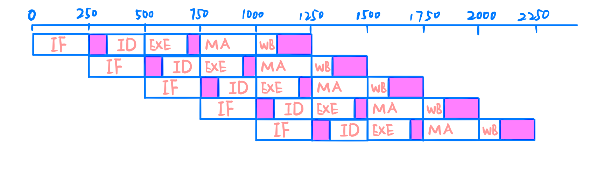
</center>
##### 3. CPU构成 (CPU Overview)

​        按照功能将CPU分为三个部分：Datapath, Controller, 和 Hazard.

<center class="image">

</center>
###### 3.1 数据通路 (Datapath)

​		Datapath由两类元件组成：

-    状态元件

​		包括可复位清零触发器(flopr, floprc, flopenr, flopenrc) ；、指令存储器（IM）、数据存储器（DM）和寄存器文件（RF）；这些元件的状态改变只发生在时钟沿改编时，是同步时序电路。输入端状态由时钟决定写入，输出端随时可以被读出。

<center class="image">


<br>

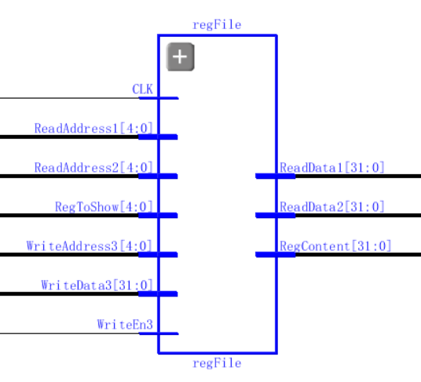
</center>

>   **可复位清零触发器(flopenrc): ** 输入信号是时钟、清除信号、使能信号、重置信号和输入信息信号，输出信号就是输入信号在时钟到来后，经过处理输出的值；这里**一共有四个类似的触发器**，分别是flopr(可复位), floprc(可复位清零), flopenr(使能复位), flopenrc(使能复位清零)。上图一仅给出可复位清零使能触发器。（其实本来用一个就可以，最开始写的时候怕自己出错就写了四个）
>
>   **指令寄存器(Instruction Memory):** 与单周期无异。
>
>   **数据存储器(Data Memory):** 与单周期无异。
>
>   **寄存器文件(Register File):** 此处寄存器文件仍与单周期基本相同，仅有一处不同，**寄存器写改成了在时钟信号下降沿写**。这样做是因为，寄存器在译码阶段就进行数据读取，但是直到写回阶段才能写入寄存器，因此会产生RAW(Read After Write)的冲突，具体的冲突化解需要在Hazard部分进行讨论

-    操作元件

	​        主要包括算术逻辑单元（ALU）、选择器（MUX2，MUX4)、符号扩展器（SignExtend）、加法器、位移器、比较器等元件，这些元件是组合逻辑电路，完成对所取得的操作数进行运算、选择、扩展、比较等工作，然后将结果交回给状态原件进行读写。

<center class="image">
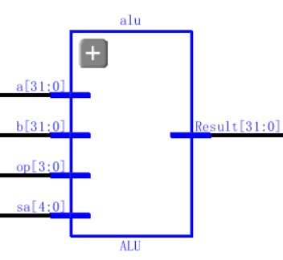


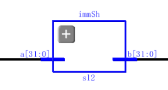
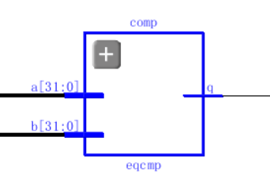
</center>

>    **算数逻辑单元(ALU):** 同单周期ALU，区别在于去掉了Zero输出信号，由下文的比较器替代。
>
>    **选择器(MUX):** 同单周期MUX2, MUX4。
>
>    **符号扩展器(Sign Extend):** 同单周期SE。
>
>    **加法器(Adder):** 同单周期Adder。
>
>    **移位器(Left Shifter): **同单周期 Left Shifter。
>
>    **比较器(Comparer):** 因为在进入ALU之前，ReadData1 和 ReadData2 需要经历转发，所以不再从ALU引出Zero信号参与PCSrc信号的赋值，故而引入比较器直接比较两者，将信号传给PCSrc进行判断赋值。

###### 3.2 控制器 (Controller)

​		Controller主要由两部分元件组成：

<center class="image">

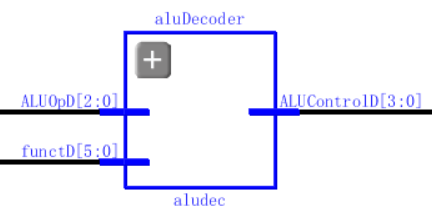
</center>
-    主译码器 (Main Decoder): 同单周期Main Decoder。

-   算数译码器 (ALU Decoder): 同单周期 ALU Decoder。

>   **Note: ** Controller里面也用了三个floprc/flopr 进行不同阶段间的信号传递。

###### 3.3 冲突处理单元 (Hazard)

​		Hazard 部件主要负责处理冲突。冲突主要可以分为数据冲突和控制冲突两类：

<center class="image">
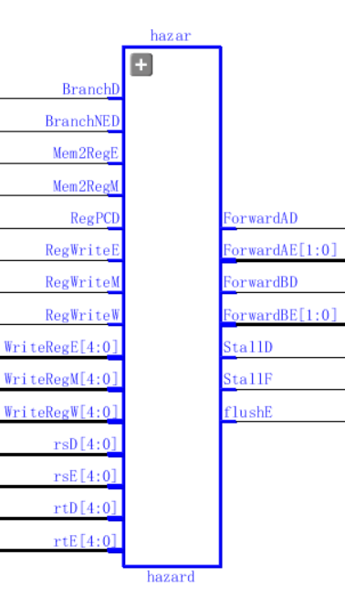
</center>
**3.3.1 数据冲突 (Data Hazardd)**

​		当一条指令试图读取前一条指令还未写回的寄存器的值时，就会发生数据冲突。数据冲突的主要解决办法有以下两种：

 <center class="image">
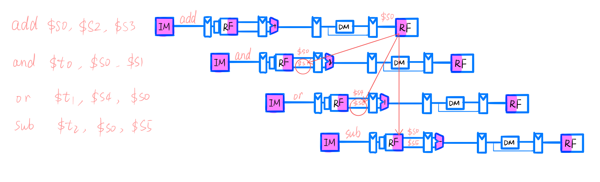
</center>
-   转发解决冲突 (Forwarding)

> ​		转发解决冲突的思路在于，当检测到数据冲突时，把ALU计算完成的结果立即发送回执行阶段，使得执行阶段提前拿到正确的结果值。

 <center class="image">

</center>

-   阻塞解决冲突 (Stalling)

>​		当在执行阶段计算指令结果时，使用转发解决RAW冲突就可以了，因为它的结果可以转发到后一个阶段的执行阶段。但是，lw指令直到存储器阶段后才能完成读数据，因此它的结果不能重定向到下一条指令的执行阶段（你在读数据人家已经在计算数据）。
>
>​		此时需要用到阻塞流水线的技术，将操作挂起直至数据有效时。当某个阶段的流水线被阻塞时，所有前面的各阶段也都被阻塞，这样后续的指令就不会丢失。在阻塞阶段后的流水线寄存器必须清楚，防止错误信息传播转发。阻塞显然会降低流水线性能，因此它只能在必要时才使用。
>
>​		通过给取指和译码阶段流水线寄存器增加使能输入EN和给执行阶段流水线寄存器增加同步复位/清除(CLR)来支持阻塞。当lw阻塞出现时，StallD 和StallF信号有效，迫使译码和取指阶段流水线寄存器保持原来的值，FlushE也有效，清除执行阶段流水线寄存器的内容，产生气泡(Bubble)，相当于nop。

 <center class="image">
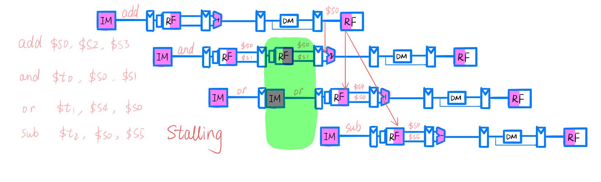
</center>
**3.3.2 控制冲突 (Control Hazard)**

​		在取指令时未确定下一条指令应该取的地址时将发生控制冲突。解决控制冲突的一种思路是暂停到下一条指令的地址确定为止，但是这个方法太慢了，我们可以结合转发技术使得预测分支尽可能地快和准确。

>   ​		预测分支是否发生时，在译码阶段增加相等比较器，PCSrc也移动到译码阶段，以及时确定目标地址。当分支不正确时，立刻清除(flush)不正确的预取指令。但是提前确定分支会带来新的RAW冲突，特别是，分支指令的源操作数由前一个指令计算得到但是还没有写入寄存器文件，分支指令将从寄存器中读到错误的操作数。这个时候就要结合转发、阻塞来消除RAW冲突。（图略）
>
>   ​		我自己实现了jr指令，jr就需要注意是否前一条指令才修改寄存器的值，jr刚好就要用那个寄存器的值，这个时候就要转发。beq/bne/jr的转发思路是类似的，都是判断是否需要阻塞，进行转发和刷新(flush)。j和jal指令则只需要转发和刷新(flush)就可以。

#### 三、实验内容

##### 1. 指令集 (Instruction Set)

​		本次实验实现的指令集主要包括以下部分：

###### 1.1 R-type Instruction

| Instruction | op(6), rs(5), rt(5), rd(5), shamt(5), func(6) |    Write Style    | Function Code |
| :---------: | :-------------------------------------------: | :---------------: | :-----------: |
|     add     |            R[rd] <= R[rs] + R[rt]             | add $rd, $rs, $rt |    100000     |
|     sub     |            R[rd] <= R[rs] - R[rt]             | sub $rd, $rs, $rt |    100010     |
|     and     |            R[rd] <= R[rs] & R[rt]             | and $rd, $rs, $rt |    100100     |
|     or      |            R[rd] <= R[rs] & R[rt]             | or $rd, $rs, $rt  |    100101     |
|     slt     |        R[rd] <= R[rs] < R[rt] ? 1 : 0;        | slt $rd, $rs, $rt |    101010     |
|     xor     |            R[rd] <= R[rs] ^ R[rt]             | xor $rd, $rs, $rt |    100110     |

###### 1.2 Shift Instruction

| Instruction | op(6), rs(5)/0(5), rt(5), rd(5), sa(5), func(6) |    Write Style     | Function Code |
| :---------: | :---------------------------------------------: | :----------------: | :-----------: |
|     sra     |              R[rd] <= R[rt] >>>sa               |  sra $rd, $rt, sa  |    000011     |
|    srav     |          R[rd] <= R[rt] >>>R[rs]\[4:0]          | srav $rd, $rs, $rt |    000111     |
|     sll     |               R[rd] <= R[rt] <<sa               |  sll $rd, $rt, sa  |    000000     |
|    sllv     |          R[rd] <= R[rt] <<R[rs]\[4:0]           | sllv $rd, $rs, $rt |    000100     |
|     srl     |               R[rd] <= R[rt] >>sa               |  srl $rd, $rt, sa  |    000010     |
|    srlv     |          R[rd] <= R[rt] >> R[rs]\[4:0]          | srlv $rd, $rs, $rt |    000110     |

###### 1.3 Load/Store Instruction

| Instruction |    op(6), base(5), rt(5), offset(16)     |     Write Style      | Op Code |
| :---------: | :--------------------------------------: | :------------------: | :-----: |
|     lw      | R[rt] <= M[R[base] + SignExtend(offset)] | lw $rt, offset(base) | 100011  |
|     sw      | R[rt] => M[R[base] + SignExtend(offset)] | sw $rt, offset(base) | 101011  |

###### 1.4 I-Type Instruction

| Instruction |      op(6), rs(5), rt(5), Imm(16)       |    Write Style     | Op Code |
| :---------: | :-------------------------------------: | :----------------: | :-----: |
|    addi     |    R[rt] <= R[rs] + SignExtend(Imm)     | addi $rt, $rs, Imm | 001000  |
|    andi     |    R[rt] <= R[rs] & ZeroExtend(Imm)     | andi $rt, $rs, Imm | 001100  |
|     ori     |    R[rt] <= R[rs] \| ZeroExtend(Imm)    | ori $rt, $rs, Imm  | 001101  |
|    xori     |    R[rt] <= R[rs] ^ ZeroExtend(Imm)     | xori $rt, $rs, Imm | 001110  |
|    slti     | R[rt] <= R[rs] < SignExtend(Imm) ? 1: 0 | slti $rt, $rs, Imm | 001010  |

###### 1.5 Branch Instruction

| Instruction |           op(6), rs(5), rt(5), offset(16)            |      Write Style      | Op Code |
| :---------: | :--------------------------------------------------: | :-------------------: | :-----: |
|     beq     | if R[rs] = R[rt] then PC <= PC + SignExtend(offset)  | beq, $rs, $rt, offset | 000100  |
|     bne     | if R[rs] != R[rt] then PC <= PC + SignExtend(offset) | bne, $rs, $rt, offset | 000101  |

###### 1.6 J-Type Instruction

| Instruction |                    op(6), instr_index(26)                    |   Write Style   | Op Code |
| :---------: | :----------------------------------------------------------: | :-------------: | :-----: |
|      J      |       PC[31:2] = PC[31:28] + instr_index[25:0] + {00}        |  J instr_index  | 000010  |
|     jal     | REG[31] = PC + 4;<br>PC[31:2] = PC[31:28] + instr_index[25:0] + {00} | jal instr_index | 000011  |

###### 1.7 J-R Instruction

| Instruction | op(0*6), rs(5), 0(5), 0(5), hint(5), funct(6) | Write Style | Function Code |
| :---------: | :-------------------------------------------: | :---------: | :-----------: |
|     jr      |                  PC <= R[rs]                  |   jr $rs    |    001000     |

###### 1.8 NOP Instruction

| Instruction | op(6), 0(5), 0(5), 0(5), 0(5), 0(6) | Write Style | Op Code |
| :---------: | :---------------------------------: | :---------: | :-----: |
|     nop     |             do nothing              |     NOP     | 000000  |

###### 1.9 Load Upper Immediate

| Instruction | op(6), 0(5), rt(5), Imm(16) | Write Style  | Op Code |
| :---------: | :-------------------------: | :----------: | :-----: |
|     lui     |    R[rt] <= Imm + {16*0}    | lui $rt, Imm | 001111  |

##### 2. 控制信号 (Control Signal)

###### 2.1 ALU真值表

| OP [2:0] |   Function   | OP [2:0] |   Function   |
| :------: | :----------: | :------: | :----------: |
|   0000   |    A & B     |   1000   |   b << 16    |
|   0001   |    A \|B     |   1001   |   b >>> sa   |
|   0010   |    A + B     |   1010   | b >>> a[4:0] |
|   0011   |    A ^ B     |   1011   |   b << sa    |
|   0100   |    A & ~B    |   1100   | b << a[4:0]  |
|   0101   |   A \| ~B    |   1101   |   b >> sa    |
|   0110   |    A - B     |   1110   | b >> a[4:0]  |
|   0111   | Set if A < B |   1111   |  a(for jr)   |

###### 2.2 Main Decoder真值表

| Control Signal |                   Meaning                   |
| :------------: | :-----------------------------------------: |
|      opD       |                  识别指令                   |
|     functD     |                  识别指令                   |
|   RegWriteD    |          1 需要写入寄存器 0 不需要          |
|  RegDstD[1:0]  | 01 R[rd]  00 R[rt] 10R[31]作为目的地寄存器  |
|    ALUSrcD     |     1 SignImm 0 RD2 选择ALU B操作数来源     |
|    BranchD     |               1 分支 0 不分支               |
|   MemWriteD    |    1 需要写入内存 0 不要（WriteEnable）     |
|    Mem2RegD    |        1 从内存读出写入寄存器 0 不要        |
|  ALUOpD[2:0]   | 协同 Function Code 一起用于ALU Decoder 译码 |
|     JumpD      |              1 发生跳转 0 不要              |
|      ExSD      |        1 表示符号扩展 0 表示 0 扩展         |
|    BranchNE    |       1 分支 0 不分支（用于识别bne）        |
|  StorePCNextD  |       是否需要用register[31]存PC地址        |
|     RegPCD     |         是否使用了regsiter存PC地址          |
|     PCSrcD     |          0 PCPlus4F    1 PCBranchD          |

###### 2.3 Instruction 真值表

| Instruction | {RegWriteD, RegDstD[1:0], ALUSrcD, BranchD, MemWriteD, Mem2RegD, ALUOpD[2:0], JumpD, ExSD, BranchNED, StorePCNextD, RegPCD} |
| :---------: | :----------------------------------------------------------: |
|   R-type    |                       101000011100000                        |
|     lw      |                       100100100000000                        |
|     sw      |                       000101000000000                        |
|    addi     |                       100100000000000                        |
|    andi     |                       100100001001000                        |
|     ori     |                       100100001101000                        |
|    xori     |                       100100010101000                        |
|    slti     |                       100100010000000                        |
|      j      |                       000000000010000                        |
|     jal     |                       110000000010010                        |
|     bne     |                       000010000100000                        |
|     beq     |                       000010000100100                        |
|     nop     |                           default                            |
|     lui     |                       100100011001000                        |
|     jr      |                       000000011100001                        |

##### 3. 顶层显示 (Top Display)

###### 3.1 功能显示

​		功能显示由于时间关系跟单周期几乎是一致的，只不过为了体现流水线预测分支的功能，我增加了显示InstrF和InstrE两个不同阶段的指令对比，从而判断预取是否正确。在上板子的时候主要用到SW[15:0]、AN[7:0]、LED[13:0]、LED16_G和LED17_R，以下是功能编码真值表

| Switch/LED |                     Input/Display                     |
| :--------: | :---------------------------------------------------: |
|  SW[7:0]   |             根据输入确定数码管显示的内容              |
|  SW[13:8]  | 当决定显示内存/寄存器时，输入以选择具体某一位置的内容 |
|   SW[14]   |                         Reset                         |
|   SW[15]   |                         Stop                          |
|  AN[7:0]   |              配合SW[7:0]显示32位数字内容              |
|  LED[4:0]  |                  显示寄存器写入地址                   |
| LED[10:5]  |                   显示内存写入地址                    |
|  LED[11]   |                    发生跳转(Jump)                     |
|  LED[12]   |                   发生分支(Branch)                    |
|  LED[13]   |              发生分支(Branch Not Equal)               |
|  LED16_G   |                 绿灯表示正在写寄存器                  |
|  LED17_R   |                  红灯表示正在写内存                   |

###### 3.2 SW[7:0]真值表

| Input SW[7:0] |      Show Case      |
| :-----------: | :-----------------: |
|   00000000    |         pcF         |
|   00000001    |  Instruction Fetch  |
|   0000001x    | Instruction Execute |
|   000001xx    |  Register Content   |
|   00001xxx    |   Memory Content    |
|   0001xxxx    | Register Write Data |
|   001xxxxx    |  Memory Write Data  |
|   01xxxxxx    |    Data Address     |
|   1xxxxxxx    |      Read Data      |

##### 4. 测试结果 (Test Result)

###### 4.1 测试1 (Test 1)

-   测试代码

​		在这一段我接着用了单周期和多周期相同的代码，在Debug过程中对代码做了一些小的修改，增加了跳转/分支指令的跳转距离（特别鸣谢助教邱皓月帮忙指出的错误），最后测得的结果是完全符合预期的。

```verilog
ROM[0] <= 32'h20020005; //addi $2, $0, 5;  //initialize $2 = 5
ROM[1] <= 32'h2003000c; //addi $3, $0, 12; //$3 = c
ROM[2] <= 32'h2067fff7; //addi $7, $3, -9; //$7 = 3
ROM[3] <= 32'h00e22025; //or $4, $7, $2;   //$4 = 3 or 5 = 7
ROM[4] <= 32'h00642824; //and $5, $3, $4;  //$5 = 12 and 7 = 4
ROM[5] <= 32'h00a42820; //and %5, %5, $4;  //$5=4+7=11
ROM[6] <= 32'h10a7000a; //beq $5, $7, end; //should not branch
ROM[7] <= 32'h2015002c; //addi $21, $0, 44;//$21 = 44 = 0x2c
ROM[8] <= 32'h02a00008; //jr $21;          //jump to ROM[11]
ROM[9] <= 32'h10a7000a; //beq, should not be taken due to jr
ROM[10] <= 32'h20150020;//addi $21, $0, 32; should not be taken due to jr;
ROM[11] <= 32'h0064202a;//slt $4, $3, $4;  //$4 = 12 < 7 = 0
ROM[12] <= 32'h10800001;//beq $4, $0, around// should be taken
ROM[13] <= 32'h20050000;//addi $5, $0, 0;  //should not be taken
ROM[14] <= 32'h00e2202a;//slt $4, $7, $2;  //$4 = 3 < 5 = 1 
ROM[15] <= 32'h00853820;//add $7, $4, $5;  //$7=1 + 11 = 12
ROM[16] <= 32'h00e23822;//sub $7, $7, $2;  //$7 = 12 - 5 = 7
ROM[17] <= 32'hac670044;//sw $7, 68($3);   //[($3 + 68)] = [80] = ROM[(80>>2)] = ROM[10100] = ROM[20] = 7
ROM[18] <= 32'h8c020050;//lw $2, 80($0);   // $2 = ROM[20] = 7
ROM[19] <= 32'h0c000017;//jal ROM[22];     //$31 = PC + 4; should be taken
ROM[20] <= 32'h08000016;//j ROM[22];       //should not be taken due to jal
ROM[21] <= 32'h00e2202a;//slt, should not be taken
ROM[22] <= 32'h20020001;//addi $2, $0, 1;  //should not be taken
						//all data memory address are virtual address, real address should +64
ROM[23] <= 32'hac020054;//sw $2, 84($0);   //ROM[(84 >> 2)] = ROM[21] = 7
ROM[24] <= 32'h3c0c1234;//lui $12, 0x1234; // $12 should be 12340000;
ROM[25] <= 32'h00a75026;//xor $10, $5, $7; // $10 = 1011 xor 0111 = 1100 = c
ROM[26] <= 32'h38ab0004;//xori $11, $5, 4; //$11 = f
ROM[27] <= 32'hac0c0010;//sw $12, 16($0);  // [16] = [16>>2] = Mem[4] = 12340000;
ROM[28] <= 32'h00054883;//sra $9, $5, 2;;  //$9 = 11 >>> 2 = 2
ROM[29] <= 32'h00854007;//srav $8, $4, $5; // $8 = [$5] >>> [$4][4:0] = 5
ROM[30] <= 32'h000469c0;//sll $13, $4, 7;; //$13 = [$4] << 7 = 00000080 = 128
ROM[31] <= 32'h00847004;//sllv $14, $4, $4;//$14 = [$4] << [$4][4:0] = 2;
ROM[32] <= 32'h00037882;//srl $15, $3, 2;; // $15 = [01100] >> 2 = 3;
ROM[33] <= 32'h00838006;//srlv $16, $4, $3;// $16 = [$3] >> [$4][4:0]=00000110 = 6
ROM[34] <= 32'h00000000;//nop
```

>   从注释中的理论代码可以看出，最终结果应该是：
>
>   $16 = 6; $15 = 3; $14 = 2;  $13 = 0x80; ...课堂演示的时候经过助教检查已经没有问题。

-    仿真结果

 <center class="image">

     <p>branch failed and jr successfully</p>
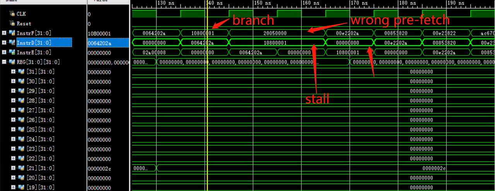
      <p>branch successfully</p>

      <p>jal successfully</p>
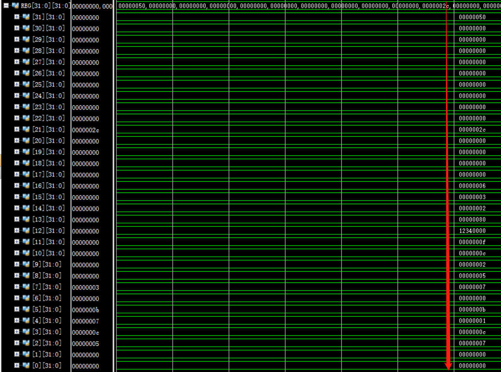
      <p>register result</p>

      <p>memory result</p>
</center>
###### 4.2 测试2 (Test 2)

-    测试代码
     		这部分的测试代码是我重新写的，完成了一个调用函数的功能，调用的函数是f(x) = x + 3 + 2 + 1。中间通过j和beq指令实现循环，通过jal和jr完成函数调用和返回，经过仿真验证和上板验证，结果符合理论结果。

     ```verilog
     		ROM[0] <= 32'h20020005; //addi $2, $0, 5;  //$2 = 5
     		ROM[1] <= 32'h2003000c; //addi $3, $0, 12; //$3 = c
             ROM[2] <= 32'h0c000008; //jal function     // call function
     		ROM[3] <= 32'h00000000; //nop
     		ROM[4] <= 32'h3c0c1234; //lui $12, 0x1234;// $12 = 0x12340000;
     		ROM[5] <= 32'h20041234; //addi $4, $0, 0x1234;  //$4 = 0x1234
     		ROM[6] <= 32'h2003000f; //addi $3, $0, f; //$3 = f
     		ROM[7] <= 32'h0800000e; //j end
     //function:
     		ROM[8] <= 32'h2067fff7; //addi $7, $3, -9; //$7 = 3
     //loop:
     		ROM[9] <= 32'h10e00003; // beq $7, $0, return;
     		ROM[10] <= 32'h00471020; // add $2, $2, $7;
     		ROM[11] <= 32'h20e7ffff; // addi $7, $7, -1;
     		ROM[12] <= 32'h08000009; // j loop;
     //return:
     		ROM[13] <= 32'h03e00008; //jr $31;
     //end:
     		ROM[14] <= 32'h00000000; //nop
     ```

-   仿真结果

     <center class="image">
    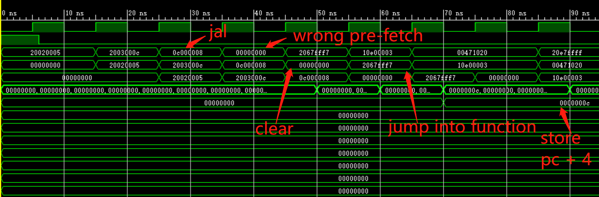
          <p>jal function call result</p>
    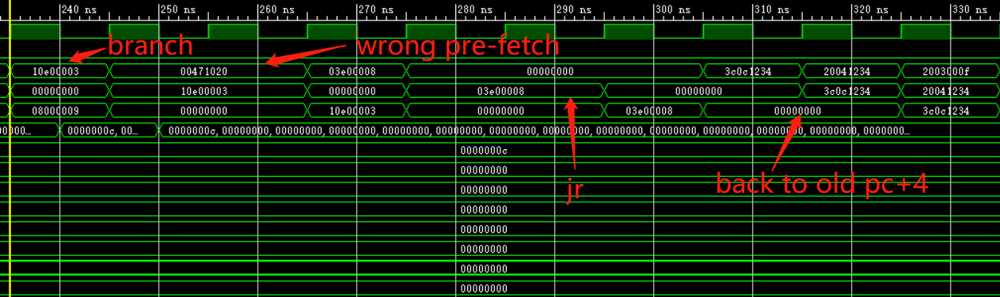
          <p>jr  return</p>
    
          <p>register result</p>
    </center>

#### 四、反思总结

##### **1. 申A理由 (Apply for A)**

（1）本次实验实现了和单周期一样多的**指令集（26+）**

（2）**实验报告详尽**地解释了流水线冲突的解决办法，并且因为在原有指令集要求的基础上添加了jal/jr两条指令，对转发/阻塞/刷新有了更进一步的应用和更为深刻的理解。

（3）尽管早就添加了jal和jr两条指令，但是终于把**调用函数**的代码写了一个出来！！！递归调用估计是可以操作的，奈何本人手动写汇编代码实在是一言难尽orz...不过不管怎么样，调用函数的功能完成了。

##### 2.反思和收获 （Pain And Gain）

（1）最开始遇见的困难是信号传递到哪个阶段比较迷，后来整体写完之后，把图画出来了，然后Debug就更容易一些。

（2）第二个debug非常困难的时期是j-type和beq/bne类型的指令，涉及的转发/阻塞和刷新需要理解比较深刻，得益于助教的帮助才意识到自己有个错误。

（3）收获在于写代码、画图，然后对流水线机制的理解更为深刻。

（4）特别鸣谢张作柏指出的刷新InstrF到InstrD的指令的触发器中，为了保证刷新的时候必须是不暂停的，添加了一行~StallD & flushD 替代flushD。这应该是教材的一个小bug。

#### 五、参考文献

[1] David Money Harris, Sarah L.Harris《Digital Design and Computer Architecture》中文版第二版

[2] MIPS32® Architecture For Programmers Volume II: The MIPS32® Instruction Set

[3] 陈辰.9 MIPS32流水线处理器 PPT

[4] www.baidu.com