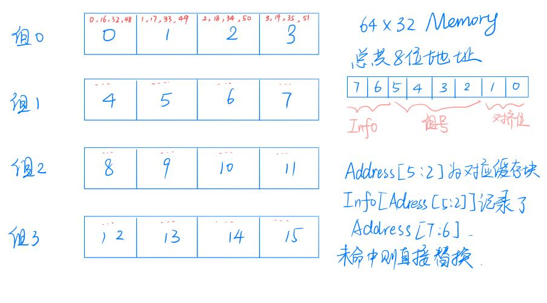
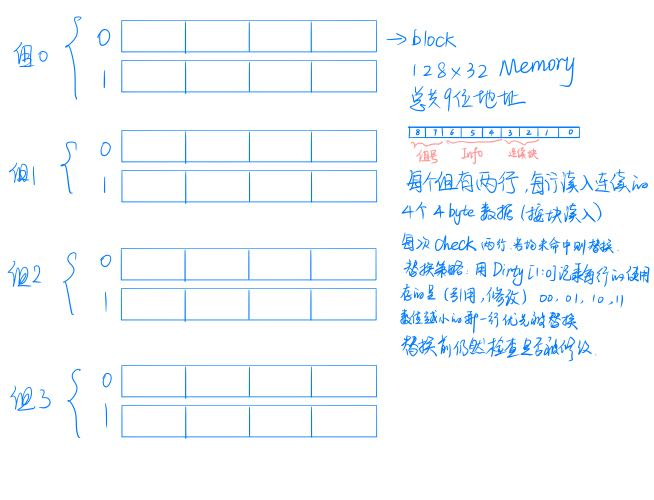
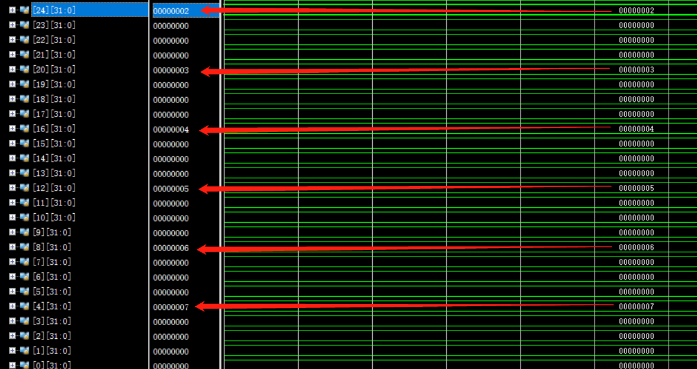

<center> <font size=5> <b>Cache设计实验报告</b></font>
</center>


[TOC]


#### 一、实验目的

​		通过设计实现Cache，进一步理解缓存的实际意义，掌握基本的缓存替换策略及其实现。

#### 二、实验原理

##### 1. Cache 简介

​		Cache机制是用读写速度更快但是更昂贵的硬件来对部分数据进行缓存，以提高CPU运行速度的一种方法。高成本决定了用来实现缓存的那部分硬件容量注定比内存要小得多；因此如何设计一个高效的缓存替换策略就成为了提高硬件利用效率的关键。

##### 2. Cache 原理

​		当CPU需要对内存进行读写时，首先按照一定的映射方式找到对应的缓存块，查看对应缓存块是否存了相应的内存块部分。如果刚好有，则称为缓存命中(cache hit)，直接对对应的缓存块进行读写操作；如果未命中，则查看Cache对应块是否被修改过 (Dirty)；若被修改过则将其写回对应内存，再从内存中取出新的内存块写入Cache中然后对缓存块进行读写操作；若未被修改过则直接从内存中读出新内存块进行覆盖然后进行读写操作；一个良好的缓存替换策略能使得cache同内存的交互次数尽可能少，保持一个较高的命中率。

##### 3. Cache 替换算法

​		常见的Cache替换算法有FIFO替换算法、OPT算法、LRU算法、时钟算法和增强时钟算法等；关于它们的详细原理在此不做赘述。本次实验实现了两个简单的Cache替换策略，详细介绍见第三部分实验内容部分。

#### 三、实验内容

##### 1. 策略1

​		最开始实现的最简单的cache替换策略如下：内存总共有64块32位的内存块， Cache有16块32位的内存块；8个内存块共用一个缓存。因为内存是64*32bits的，所以只需要Address[7:0]就可以。Address[5:2]决定该地址的内存块（单个4byte块）映射到哪个Cache块（0-15），对应的Info记录该缓存块存的内存块的Address[7:6]。整体的替换策略如第二部分中cache原理部分所述。然后传出一个hit[1:0]的信号，该信号为11时表示无事发生，该信号为00时表示读或写未命中，该信号为01时表示读或写命中。当该信号低位为0时会引发流水线寄存器（五个阶段）全体暂停，这样会让流水线暂停一个周期。

<center class="image">

</center>

##### 2. 策略2

​		实现上述替换策略后，又设计了类似于LRU的替换算法：将内存扩充为128*32bits，Cache有4个组，每组两行，每行存储连续的4个4bytes块，这样Memory需要用到的地址为9位，Address[8:0]。

<center class="image">

</center>
​		访存时，Address[8:7]决定对应组号，然后去检查组内的两行是否命中，命中则直接进行相应操作。未命中则进行替换，替换策略为：

>   ​		**引入Dirty[3:0] [1:0] [1:0] 和last[3:0]。**
>
>   ​		Dirty[组名] [行号] [1:0]记录四个组的各自两行的两个数据 (refereed, modified)，分别表示引用位和修改位。对应值越小，说明最近最少使用（重要性越低），被替换的优先级越高。
>
>   ​		而last[3:0]则表示第几组的上一次被替换的行号，例如last[3] = 0表示第三组上次被替换的行号是0。
>
>   ​		在未命中的时候，首先比较对应组的两个行的Dirty值，Dirty值小的优先被替换，如果两个Dirty值相等，则查看对应组的last值，然后替换与last值相反的行号。如果上次被替换的是line 0，则这次替换line 1。
>
>   ​		**这样做的好处是**，首先根据与时钟算法类似的（引用位，修改位）信息判断行的重要性，进行一个筛选，当无法判断两行的重要性的时候，就根据上一次替换的行来决定这一次替换的行，避免了只替换一行的情况出现（最开始写的时候就出现这个情况），在用优先级确定替换目标的同时，又保证了一定的随机性。

##### 3. 顶层显示 (Top Display)

###### 3.1 功能显示 (Display What)

顺带修改了一下顶层显示：

主要用到SW[15:0]、AN[7:0]、LED[14: 0]、LED16_G和LED17_R，以下是功能编码真值表

| Switch/LED |                       Input/Display                        |
| :--------: | :--------------------------------------------------------: |
|  SW[6:0]   |                根据输入确定数码管显示的内容                |
|  SW[13:7]  | 当决定显示内存/寄存器/缓存时，输入以选择具体某一位置的内容 |
|   SW[14]   |                           Reset                            |
|   SW[15]   |                            Stop                            |
|  AN[7:0]   |                配合SW[7:0]显示32位数字内容                 |
|   LED[0]   |           显示执行阶段的写寄存器信号(RegWriteE)            |
|   LED[1]   |                  显示内存写入地址(JumpD)                   |
|   LED[2]   |                     发生分支(BranchD)                      |
|   LED[3]   |                    发生分支(BranchNED)                     |
|   LED[4]   |                     确定PC来源(PCSrcD)                     |
|   LED[5]   |                   ALUSrcB的来源(ALUSrcE)                   |
|  LED[9:6]  |                 ALU执行的操作(ALUControlE)                 |
|  LED[10]   |                       jr指令(RegPCD)                       |
|  LED[11]   |                   jal指令(StorePCNextD)                    |
|  LED[12]   |                     符号扩展信号(ExSD)                     |
| LED[14:13] |                确定写寄存器的地址(RegDstE)                 |
|  LED16_R   |              红灯，表示hit[1:0]的等于00，miss              |
|  LED16_G   |               绿灯，表示hit[1:0]等于01，hit                |
|  LED16_B   |             蓝灯，表示hit[1:0]等于11，没有访存             |
|  LED17_R   |                  红灯亮表示ReadEnable为1                   |
|  LED17_G   |                  绿灯亮表示WriteEnable为1                  |

###### 3.2 SW[6:0]真值表

| Input SW[6:0] |      Show Case      |
| :-----------: | :-----------------: |
|    0000000    |         PC          |
|    0000001    |       InstrF        |
|    0000010    |       InstrE        |
|    0000100    |  Register Content   |
|    0000101    | Register Write Data |
|    0000110    |   Write Register    |
|    0001000    |   Memory Content    |
|    0001001    |     Write Data      |
|    0001010    |    Data Address     |
|    0001011    |      Read Data      |
|    0010000    |    Cache Content    |
|    0100000    |       SrcA2E        |
|    0100001    |       SrcB3E        |

###### 3.3 数据通路改进 (Datapath Modify)

​		从Cache中引出hit信号，修改flopenr, flopenrc，加入优先级仅次于CLK的信号hit，如果未命中，则原地忙等待（将输出直接传给输出），起到暂停的作用。

##### 4. 仿真测试 (Simulation)

###### 4.1 测试代码 (Test Code)

```verilog
ROM[0] <= 32'h20010001; //addi $at, $0, 1
ROM[1] <= 32'h20020002; //addi $v0, $0, 2
ROM[2] <= 32'h20030003; //addi $v1, $0, 3
ROM[3] <= 32'h20040004; //addi $a0, $0, 4
ROM[4] <= 32'h20050005; //addi $a1, $0, 5
ROM[5] <= 32'h20060006; //addi $a2, $0, 6
ROM[6] <= 32'h20070007; //addi $a3, $0, 7
ROM[7] <= 32'h20090000; //addi $t1, $0, 0
ROM[8] <= 32'hac070010; //sw $a3, 16($0)
ROM[9] <= 32'h8c080010; //lw $t0, 16($0)
ROM[10] <= 32'h01284820; //add $t1, $t1, $t0
ROM[11] <= 32'hac060020; //sw $a2, 32($0)
ROM[12] <= 32'h8c080020; //lw $t0, 32($0)
ROM[13] <= 32'h01284820; //add $t1, $t1, $t0
ROM[14] <= 32'hac050030; //sw $a1, 48($0)
ROM[15] <= 32'h8c080030; //lw $t0, 48($0)
ROM[16] <= 32'h01284820; //add $t1, $t1, $t0
ROM[17] <= 32'hac040040; //sw $a0, 64($0)
ROM[18] <= 32'h8c080040; //lw $t0, 64($0)
ROM[19] <= 32'h01284820; //add $t1, $t1, $t0
ROM[20] <= 32'hac030050; //sw $v1, 80($0)
ROM[21] <= 32'h8c080050; //lw $t0, 80($0)
ROM[22] <= 32'h01284820; //add $t1, $t1, $t0
ROM[23] <= 32'hac020060; //sw $v0, 96($0)
ROM[24] <= 32'h8c080060; //lw $t0, 96($0)
ROM[25] <= 32'h01284820; //add $t1, $t1, $t0
ROM[26] <= 32'hac010070; //sw $at, 112($0)
ROM[27] <= 32'h8c080070; //lw $t0, 112($0)
ROM[28] <= 32'h01284820; //add $t1, $t1, $t0
ROM[29] <= 32'h8c010010; //lw $at, 16($0)
ROM[30] <= 32'h01214820; //add $t1, $t1, $at
ROM[31] <= 32'h8c020020; //lw $v0, 32($0)
ROM[32] <= 32'h01224820; //add $t1, $t1, $v0
ROM[33] <= 32'h8c030030; //lw $v1, 48($0)
ROM[34] <= 32'h01234820; //add $t1, $t1, $v1
ROM[35] <= 32'h8c040040; //lw $a0, 64($0)
ROM[36] <= 32'h01244820; //add $t1, $t1, $a0
ROM[37] <= 32'h8c050050; //lw $a1, 80($0)
ROM[38] <= 32'h01254820; //add $t1, $t1, $a1
ROM[39] <= 32'h8c060060; //lw $a2, 96($0)
ROM[40] <= 32'h01264820; //add $t1, $t1, $a2
ROM[41] <= 32'h8c070070; //lw $a3, 112($0)
ROM[42] <= 32'h01274820; //add $t1, $t1, $a3
ROM[43] <= 32'h00000000; //nop
```

>   ​		解释：这个测试代码的功能是：先往8个寄存器里写入初始值，然后把这几个寄存器里的值依次写入内存，每写进去一个，就把对应内存位置的值读出来到一个寄存器里，然后把这个寄存器的值累加到另一个专门放累加结果的寄存器里，依次进行。完成以后，累加寄存器的值应该是 1+2+3+4+5+6+7 = 28 = 0x1c。在这之后再反过来加一遍。最后的值应该是56 = 0x38；
>
>   ​		鸣谢：我使用了张作柏同学的assembler。对assembler加以修改后，写好汇编代码用其生成机器码。

###### 4.2 仿真结果 (Simulation Test)

<center class="image">

    <p>
        最后register的值
    </p>

    <p>
        最后Memory的值
    </p>

    <p>
        miss的延迟和hit的不延迟
    </p>
</center>

###### 4.3 开发板测试 (NEXYS 4 DDR)

​		因为上机课验收未能完成，私下已经私发视频给郭天成助教验收，如果有疑问可以随时当面进行测试。

